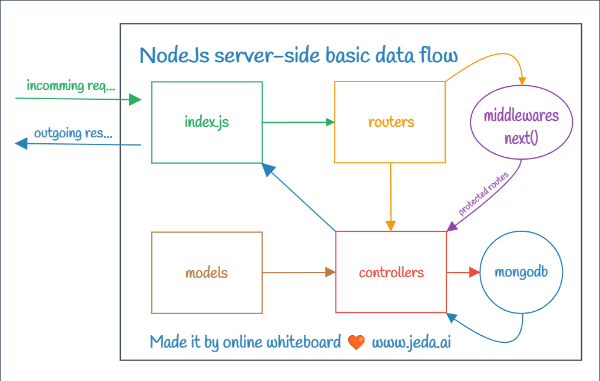

> 20 - Sep - 2024

# Linkedin Clone


## Backend endpoints:-
| No| Context & File Link                     | Method | Api Endpoint             |
| --| --------------------------------------- | ------ | -------------------------|
| 1 | [Registration][registration]            | POST   | /api/v1/auth/`register`  |
| 2 | [Login][userLogin]                      | POST   | /api/v1/auth/`login`     |
| 3 | [Logout][userLogout]                    | POST   | /api/v1/auth/`logout`    |
| 4 | [Check Auth][checkAuth]                 | GET    | /api/v1/auth/`me`        |

[registration]:      ./backend/src/modules/auth/controllers/registration.js
[userLogin]:         ./backend/src/modules/auth/controllers/login.js
[userLogout]:        ./backend/src/modules/auth/controllers/logout.js
[checkAuth]:         ./backend/src/modules/auth/controllers/getCurrentUser.js


<br/>

## To run backend properly, setup the `.env` file

```js
# 🟢 To run this Linkedin-Clone project & for proper testing... 
# 🟢 these following values will be required...

MONGODB_URI = *******

CLIENT_URL = *******

JWT_NAME = *******
JWT_SECRET = *******
JWT_EXPIRES_IN = *******

MAILTRAP_ENDPOINT = *******
MAILTRAP_TOKEN = *******

MAILTRAP_SENDER_EMAIL = *******
MAILTRAP_SENDER_NAME = *******

MAILTRAP_WELCOME_MAIL_TEMPLATE_UUID = *******
MAILTRAP_COMPANY_INFO_NAME = *******

CLOUDINARY_CLOUD_NAME = *******
CLOUDINARY_API_SECRET = *******
CLOUDINARY_API_KEY = *******
```

<br/>

## Backend run in local:-

```
cd backend
```
```
yarn dev
```

## Frontend run in local:-

```
cd frontend
```
```
yarn dev
```

<br/>

## NodeJs | Backend Basic Data Flow...

